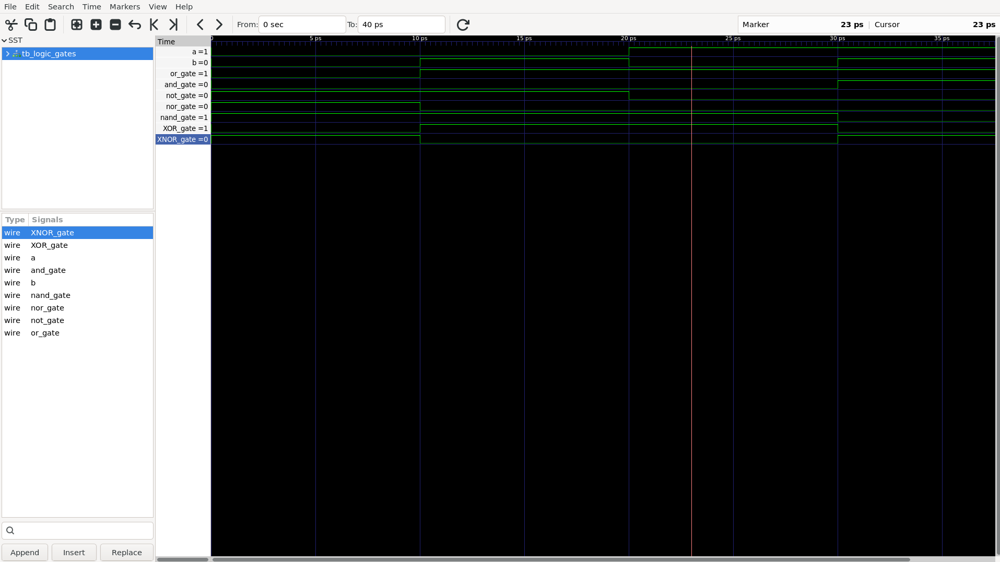

# Basic Logic Gates — SystemVerilog

## Objective

Implement and simulate fundamental digital logic gates using SystemVerilog.

## Gates Implemented

* NOT
* AND
* OR
* NAND
* NOR
* XOR
* XNOR

## Design

The gates are implemented using combinational `assign` statements.

## Verification

A SystemVerilog testbench applies all four possible combinations of two 1-bit inputs:

| A | B |
| - | - |
| 0 | 0 |
| 0 | 1 |
| 1 | 0 |
| 1 | 1 |

The outputs are observed in simulation and verified using the generated waveform.

## Tools

* SystemVerilog
* Verilator 5.051
* GTKWave

## Simulation Flow

```text
SystemVerilog RTL
       ↓
   Verilator
       ↓
   Simulation
       ↓
    dump.vcd
       ↓
    GTKWave
```

## Result

All implemented logic gates produced the expected truth-table behavior for the tested input combinations.

### Waveform




