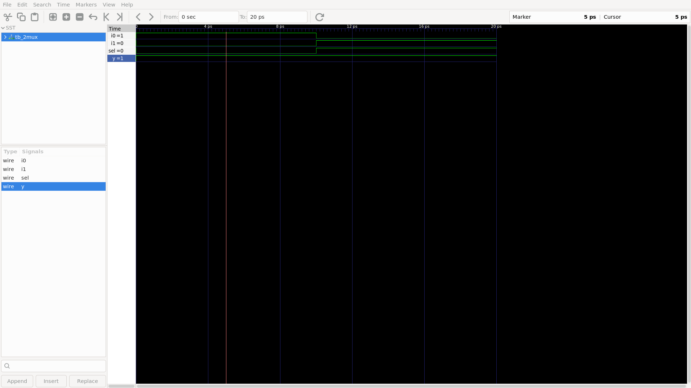
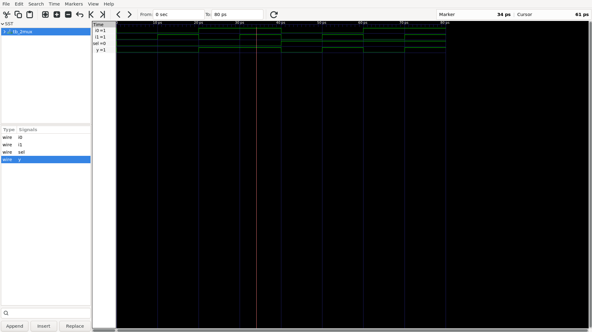
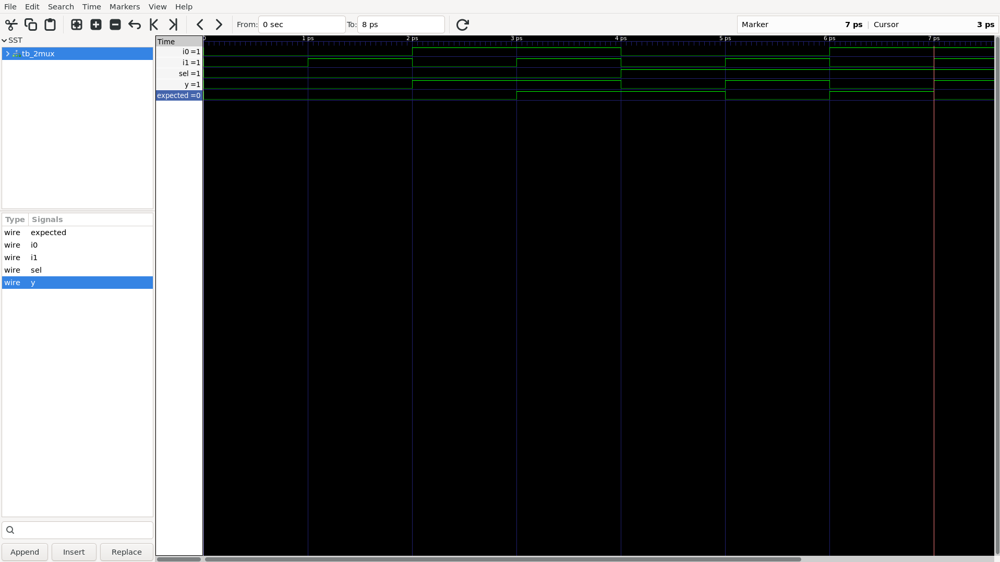

# 2:1 Multiplexer — SystemVerilog

## Objective

Design and simulate a 2:1 multiplexer using SystemVerilog.

The multiplexer selects one of two 1-bit inputs based on a select signal.

---

## 1. Design

### Inputs

- `i0` — Input 0
- `i1` — Input 1
- `sel` — Select signal

### Output

- `y` — Multiplexer output

### Selection Logic

Compact Truth Table

| `sel` | Selected Input | `y` |
|------:|----------------|-----|
| 0     | `i0`           | `i0` |
| 1     | `i1`           | `i1` |


### Selection Logic

Complete Truth Tabled

| `sel` | `i0` | `i1` | `y` |
|------:|-----:|-----:|----:|
| 0 | 0 | 0 | 0 |
| 0 | 0 | 1 | 0 |
| 0 | 1 | 0 | 1 |
| 0 | 1 | 1 | 1 |
| 1 | 0 | 0 | 0 |
| 1 | 0 | 1 | 1 |
| 1 | 1 | 0 | 0 |
| 1 | 1 | 1 | 1 |

### Waveform





### Boolean Expression

The multiplexer is implemented using:

```text
y = (~sel & i0) | (sel & i1)

