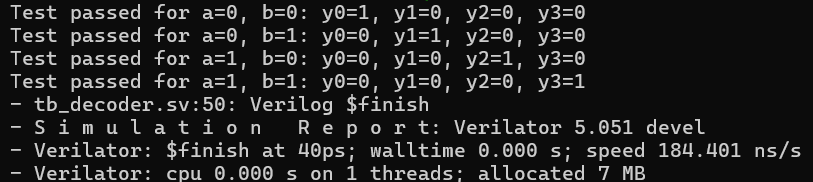
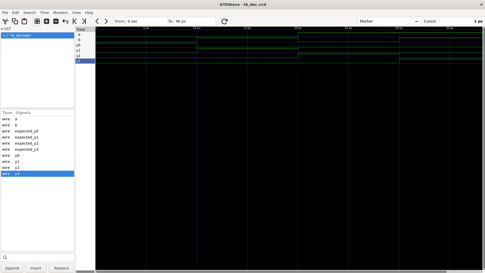

# 2-to-4 Decoder

## Overview
This project implements a 2-to-4 binary decoder in SystemVerilog. The design takes two binary inputs, `a` and `b`, and generates four mutually exclusive output lines: `y0`, `y1`, `y2`, and `y3`.

A decoder activates exactly one output depending on the input combination. This makes it useful in address decoding, control logic, and digital selection circuits.

## Design Description
The decoder module is implemented in `decoder.sv` and uses simple Boolean logic:

- `y0 = ~a & ~b`
- `y1 = ~a & b`
- `y2 = a & ~b`
- `y3 = a & b`

This produces the following behavior:

| a | b | y0 | y1 | y2 | y3 |
|---|---|----|----|----|----|
| 0 | 0 | 1  | 0  | 0  | 0  |
| 0 | 1 | 0  | 1  | 0  | 0  |
| 1 | 0 | 0  | 0  | 1  | 0  |
| 1 | 1 | 0  | 0  | 0  | 1  |

## Module Ports
The `decoder` module has the following ports:

- `input a` : MSB input bit
- `input b` : LSB input bit
- `output y0` : Output for `ab = 00`
- `output y1` : Output for `ab = 01`
- `output y2` : Output for `ab = 10`
- `output y3` : Output for `ab = 11`

## Testbench
The testbench file `tb_decoder.sv` verifies the decoder for all possible input combinations.

It performs the following tasks:

- Instantiates the `decoder` DUT
- Applies all four combinations of `a` and `b`
- Computes expected output values
- Compares them to the DUT outputs
- Prints pass/fail messages for each test case
- Generates a waveform file named `tb_dec.vcd`

## Files in This Project
- `decoder.sv` : 2-to-4 decoder implementation
- `tb_decoder.sv` : SystemVerilog testbench for verification
- `tb_dec.vcd` : Simulation waveform output generated during testing

## Simulation Waveforms

## Result
The implemented design behaves as a correct 2-to-4 decoder, with one output asserted high for each valid binary input combination and all other outputs low.
