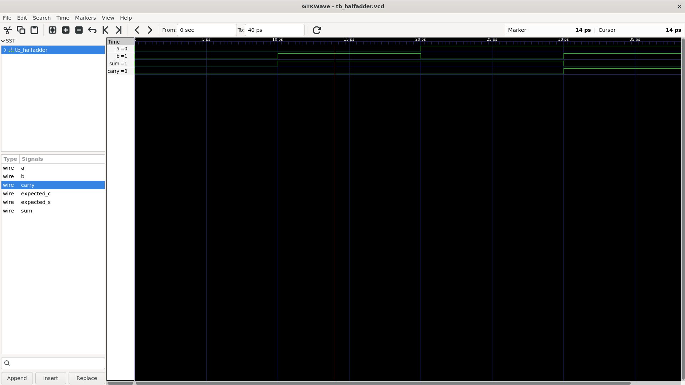
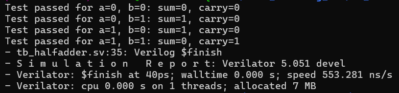

# Half Adder in SystemVerilog

This project implements a simple 1-bit half adder using SystemVerilog. A half adder takes two single-bit inputs and produces a sum bit and a carry bit.

## Functionality

The logic used is:

- Sum = a XOR b
- Carry = a AND b

This is the basic arithmetic operation for adding two 1-bit binary numbers.

## Truth Table

| a | b | sum | carry |
|---|---|-----|-------|
| 0 | 0 | 0   | 0     |
| 0 | 1 | 1   | 0     |
| 1 | 0 | 1   | 0     |
| 1 | 1 | 0   | 1     |

## File Descriptions

- `halfadder.sv`  
  Contains the half-adder design module. It defines the inputs `a` and `b`, and the outputs `sum` and `carry`.

- `tb_halfadder.sv`  
  Testbench for the half adder. It applies all possible input combinations (00, 01, 10, 11), drives the design under test, and prints the result of each simulation case.

- `tb_halfadder.vcd`  
  Value Change Dump (VCD) waveform file generated during simulation. It can be opened with waveform viewers such as GTKWave to inspect signal transitions.

- `images/`  
  Directory containing image assets related to the design or simulation results.

- `obj_dir/`  
  Generated simulation build artifacts created by the Verilog/SystemVerilog toolchain.

## Simulation Waveforms

## Notes

This design is a fundamental building block used in larger arithmetic circuits such as full adders, adders, and ALU components.
