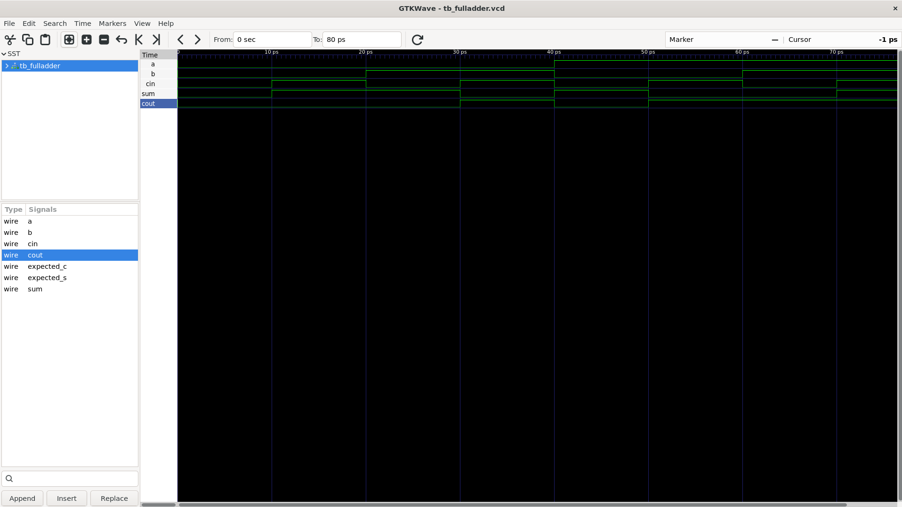
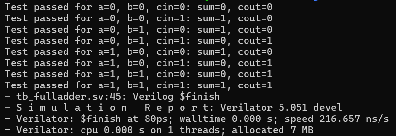

# Full Adder Design in SystemVerilog

This project contains a 1-bit full adder implemented in SystemVerilog along with a simple testbench to verify its behavior across all possible input combinations.

## Project Files

- `fulladder.sv` — Full adder design under test (DUT)
- `tb_fulladder.sv` — Testbench that drives the inputs and checks the outputs
- `tb_fulladder.vcd` — Waveform dump generated during simulation

## Design Overview

The full adder is a combinational digital logic circuit that adds three 1-bit inputs:

- `a` : first input bit
- `b` : second input bit
- `cin` : carry-in from a previous stage

It produces:

- `sum` : resulting bit of the addition
- `cout` : carry-out bit to the next stage

The logic equations implemented are:

- `sum = a ^ b ^ cin`
- `cout = (a & b) | (b & cin) | (a & cin)`

These equations describe the standard full adder operation used in binary arithmetic.

## Module Interface

```systemverilog
module fulladder(
    input logic a,
    input logic b,
    input logic cin,
    output logic sum,
    output logic cout
);
```

## Truth Table

| a | b | cin | sum | cout |
|---|---|-----|-----|------|
| 0 | 0 | 0   | 0   | 0    |
| 0 | 0 | 1   | 1   | 0    |
| 0 | 1 | 0   | 1   | 0    |
| 0 | 1 | 1   | 0   | 1    |
| 1 | 0 | 0   | 1   | 0    |
| 1 | 0 | 1   | 0   | 1    |
| 1 | 1 | 0   | 0   | 1    |
| 1 | 1 | 1   | 1   | 1    |

## Testbench Description

The testbench `tb_fulladder.sv` instantiates the module and iterates through all combinations of `a`, `b`, and `cin` using nested loops.

For each case:

- the inputs are assigned,
- a simulation delay is applied,
- the outputs are observed,
- the result is displayed using `$display`,
- a VCD waveform is created via `$dumpfile` and `$dumpvars`

This verifies the full adder output for every possible input condition.

## Simulation Waveforms




## Purpose

This example is useful for learning:

- SystemVerilog module design
- combinational logic modeling
- full adder implementation
- RTL simulation and waveform viewing
- basic testbench structure for digital design verification

## Summary

The `fulladder` module is a fundamental arithmetic building block. It performs the addition of two single-bit inputs and a carry-in, generating a sum bit and carry-out bit. This design is the basis for larger arithmetic circuits such as ripple-carry adders and multi-bit adders.
